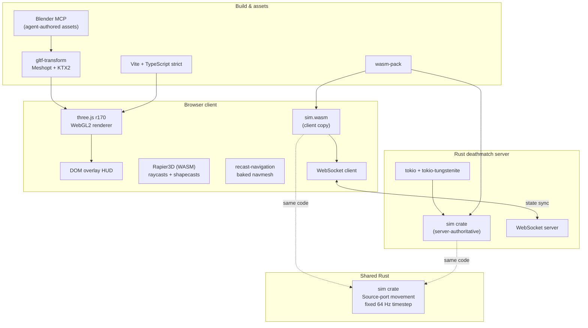

# Counter Douglas Globally Offended

[](https://github.com/beanthemoonman/dougiesbigtrip/actions/workflows/ci.yml)
[](tsconfig.json)
[](sim/Cargo.toml)
[](https://threejs.org)
[](sim/)
[](https://vitejs.dev)
[](docker-compose.yml)
[](docs/licensing-and-assets.md)

A browser FPS demo that imitates the look and feel of **Counter-Strike: Source** using only
CC0/permissively-licensed assets. The goal is *feel and art-direction fidelity*, not feature
completeness — movement that feels wrong is a P0 bug; a missing scoreboard is a P3.

No Valve assets, ever. Every texture, model, and sound is CC0 or permissively licensed with a
row in [`assets/CREDITS.md`](assets/CREDITS.md).

## Tech stack



### Why each piece

| Concern | Choice | Why |
|---|---|---|
| **Renderer** | [three.js](https://threejs.org) r170 (WebGL2) | The Source look is *baked lightmaps*, not realtime lights — three.js gives us lightmapped materials and a viewmodel render pass without a heavyweight engine. |
| **Physics** | [`@dimforge/rapier3d-compat`](https://rapier.rs) (WASM) | Used **only** for raycasts and collide-and-slide shapecasts. The character controller is hand-rolled — Rapier's built-in movement response doesn't feel like CS:S. |
| **Character movement** | Hand-rolled Rust `sim` crate | Air-accel, ground friction, and bhop/surf-adjacent behaviour are exact ports of the Source formulas in [`docs/source-movement.md`](docs/source-movement.md). Not invented, not "improved." |
| **Shared simulation** | [WebAssembly](https://webassembly.org) via [`wasm-pack`](https://rustwasm.github.io/wasm-pack/) | The `sim` crate compiles once and runs in **both** the browser and the server. The server is authoritative; the client runs the identical WASM for prediction. One codebase, no drift. See [`docs/netcode.md`](docs/netcode.md). |
| **Server** | Rust + [tokio](https://tokio.rs) + tokio-tungstenite | Async WebSocket deathmatch server sharing the `sim` crate directly (native, not WASM). |
| **Navigation** | [recast-navigation](https://github.com/isaac-mason/recast-navigation-js) | Bot pathing on a navmesh baked offline to a binary blob. |
| **Build** | [Vite](https://vitejs.dev) + TypeScript (strict) | Fast HMR dev server; `vite-plugin-wasm` loads the shared sim. |
| **Assets** | glTF 2.0 `.glb`, Meshopt + [KTX2](https://github.khronos.org/KTX-Specification/) | Compressed via `gltf-transform` to hit the 48 MB initial / 60 MB total download budget. |
| **UI/HUD** | Plain DOM overlay | No React for a crosshair. |
| **Deploy** | Docker + compose | Separate client (nginx) and server images. |

### The agent authors the assets

There are no store-bought models in this repo. The 3D assets — maps, weapon viewmodels, props —
are created and edited **by Claude (the agent) driving Blender over an MCP server**. The agent
models geometry, bakes lightmaps, and exports glTF through the pipeline scripts in
[`tools/blender/`](tools/blender/); the export/optimize path is documented in
[`docs/blender-pipeline.md`](docs/blender-pipeline.md) and [`docs/asset-pipeline.md`](docs/asset-pipeline.md).
Every generated asset still earns its CC0/permissive licence row in
[`assets/CREDITS.md`](assets/CREDITS.md).

## Architecture notes

- **Server-authoritative, client-predicted.** The same Rust `sim` crate is the single source of
  truth for movement and collision. The server runs it natively; the browser runs the exact same
  logic compiled to `sim.wasm`. This is why the download budget was raised to 60 MB — to absorb
  the shared WASM.
- **Fixed 64 Hz timestep.** Simulation runs on an accumulator with interpolated rendering.
  Frame-rate-dependent physics changes the feel and is a bug. Nothing below `core/loop.ts` reads
  frame delta.
- **Deterministic.** `simulate(trace, {seed})` twice produces identical snapshots. RNG is seeded
  and injected — no `Date.now()` / `Math.random()` in the sim.

See [`docs/`](docs/) for the full set of specs. The docs are the spec — if code and doc disagree,
one of them is a bug.

## Getting Started

```bash
pnpm install
pnpm dev
```

## Commands

| Command | Description |
|---|---|
| `pnpm dev` | Vite dev server |
| `pnpm build` | Production build |
| `pnpm typecheck` | TypeScript type checking |
| `pnpm test` | Vitest test suite (movement math has golden tests — keep them green) |
| `pnpm lint` | ESLint |
| `pnpm format` | Prettier |
| `pnpm assets:opt` | gltf-transform: Meshopt/Draco + KTX2 |
| `pnpm nav:bake` | Regenerate navmesh blob from `assets/maps/*.glb` |

### Running the server

The Rust deathmatch server and client ship as separate Docker images:

```bash
docker compose up
```

Rebuilding the shared WASM sim after editing `sim/src/` requires a specific ritual (pnpm keeps a
stale `file:` copy) — see the "Rebuilding the shared WASM sim" section in [`CLAUDE.md`](CLAUDE.md).

## Repo layout

```
src/       core loop, render, physics, player movement, weapons, ai, game, ui
sim/       shared Rust simulation crate → compiles to WASM (client) + native (server)
server/    Rust WebSocket deathmatch server
assets/    maps, weapons, props, characters, audio + CREDITS.md
tools/     blender export/bake, navbake, gltf optimize
docs/      the specs
tests/     golden (spec-derived), baseline (recorded), traces, harness, acceptance
```
