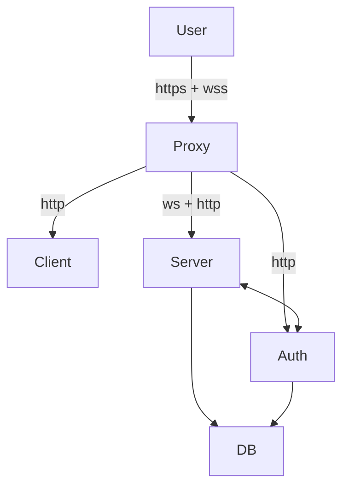

# Plan to Implement

Target: a browser FPS demo with CS:Source-like look and movement feel. One map, two weapons,
bots, round loop. Starts single-player (~5 weeks of evenings through Phase 5), then grows into
a multiplayer deathmatch with an authoritative Rust server (Phase 6), ragdolls (Phase 7), and
a containerized deploy (Phase 8). Phases 9–14 then add the game-flow entry (team select /
spectator / join gating), movement & interaction tuning, an advanced search-and-engage bot AI,
a third-person fidelity + ragdoll redux, a real-texture asset refinement, and a final
end-to-end hardening pass. Phase 15 tags 1.0; Phases 16–20 then turn the demo into a deployed,
multi-user product (configurable matches, Keycloak/Google auth, a database of record, and the
entry/settings/admin screens around it).

Each phase ends with a **demoable build** and an **exit test** you can actually perform.
Do not start phase N+1 until phase N's exit test passes.

Each phase's exit test becomes a committed `tests/acceptance/ACC-*.md` script with a PASS
recorded against a commit hash. Every task inside a phase is subject to the Definition of Done
in `CLAUDE.md`.

---

## Phase 0 — Scaffold (½ day)

- [x] `pnpm create vite` → TS template. Add three, rapier3d-compat, howler.
- [x] `tsconfig` strict. Vitest. Prettier/eslint. `pnpm typecheck` in CI.
- [x] Renderer boot: WebGL2, ACESFilmic tonemapping, sRGB output, `stats.js` panel.
- [x] `core/loop.ts`: fixed 64 Hz accumulator + render interpolation. **Do this now, not later.**
      Retrofitting fixed timestep is miserable.
- [~] `core/scratch.ts`: pooled Vector3/Quaternion/Matrix4 to keep the hot loop allocation-free.
      (Module-local scratch variables exist across the codebase, but the centralised shared pool
      does not. Functional — not hot-loop-optimal.)
- [x] `core/rng.ts`: seeded `mulberry32`, injected. **No global `Math.random` under `src/`.**
- [ ] `tests/harness/sim.ts`: `simulate(trace, {seed}) -> snapshot`. Plus the determinism test
      (`simulate` twice → identical). See `docs/testing.md` — this is the foundation the whole
      test strategy stands on, and retrofitting it is not realistic.
- [ ] Input trace record/replay + a `?record` debug flag that dumps the last 30 s to JSON.
- [x] Pointer lock + input manager (keydown/keyup → `wishdir` bitmask, mouse delta → yaw/pitch).
- [x] `assets/CREDITS.md` created and empty. Discipline starts at commit 1.

**Exit test:** a spinning cube at a locked 64 Hz sim / uncapped render, stats panel visible,
pointer lock engages and releases cleanly on Esc.

---

## Phase 1 — Movement (the whole point) — 1 week

Read `docs/source-movement.md` first, entirely. This phase is the difference between "a
three.js demo" and "feels like CS."

- [x] Rapier world, static box colliders for a greybox room, kinematic capsule for player.
      Capsule: radius 0.4064 m, standing height 1.8288 m, ducked 0.9144 m. (Used cuboid
      colliders instead of a trimesh for the greybox — simpler and better-suited for
      axis-aligned test geometry; real map geometry in Phase 3 may still want a trimesh.)
- [x] Implement `categorizePosition()` — ground trace, ground vs. air state, surface normal.
- [x] Implement `friction()`, `accelerate()`, `airAccelerate()` per the doc's formulas.
- [x] Implement `tryPlayerMove()` — collide-and-slide with 4 clip iterations + `clipVelocity`
      with the 1.0 overbounce factor.
- [x] Step offset (`stepSize` = 0.4572 m): `stairs` up-trace / down-trace pass.
- [x] Jump: fixed impulse `6.816 m/s` (= `sqrt(2 * 20.32 * 1.143)`, a 45-unit rise).
- [x] Duck: crouch transition timing (view-only lerp) and duck-jump (binary hull swap pulls
      feet up/down in air to anchor the hull's top). Ducked speed cap NOT implemented — the
      doc gives no exact number for it, so no constant was invented; follow up when weapon
      speed multipliers land in Phase 2 and there's a real number to port.
- [x] Air-strafe works: mouse + A/D in air gains speed. **This is the acceptance criterion.**
      Proven analytically by the Case C golden test (airAccelerate alone, no world) and
      confirmed live as part of Phase 2's exit test sign-off.
- [x] `movement.test.ts` — golden tables from the doc. Keep green forever.
- [x] View: eye height 1.6256 m (0.7112 m ducked), landing view-punch, no view bob yet.

**Exit test — CONFIRMED.** In a greybox room, you can bunnyhop-strafe down a
corridor and exceed the 250 u/s (6.35 m/s) ground speed cap. Standing still on a slope
doesn't slide. Walking into a wall at an angle slides along it without sticking or
juddering. Stairs are walked up, not jumped up.

Status: all code is written, `pnpm typecheck`/`pnpm lint`/`pnpm test` are green, and the
Case A/B/C golden tests match the doc's reference tables exactly. The live pass was
completed as part of Phase 2's sign-off — ground acceleration caps at 6.35 m/s, friction
decay matches expected ratios, stairs walk smoothly, and the ramp holds without sliding.
Phase 1 is complete.

---

## Phase 2 — Combat (1 week)

Read `docs/weapon-feel.md`.

- [x] Weapon defs data file: rate of fire, damage, armour pen, range falloff, spread,
      recoil table, mag size, reload time, movement speed multiplier. (`src/weapons/defs.ts`,
      T0 invariants in `defs.test.ts`. Rifle + pistol authored. NOTE: this landed before the
      Phase 1 live exit test was confirmed — pure data, no dependency on movement; the live
      pass is still owed before wiring hitscan/recoil that consume these.)
- [x] Two guns to start: an AK-analogue (rifle) and a USP-analogue (pistol). Distinct feel:
      spray vs. tap. (Both modelled in Blender — `ak_viewmodel.glb` / `pistol_viewmodel.glb`.
      Wired in `main.ts`: `1`/`2` switch, per-weapon ammo/recoil state persists across switches,
      distinct recoil/spread/cadence from `defs.ts`. T3: ACC-006.)
- [x] Hitscan: raycast from camera centre (**not** the muzzle), with spread applied in a
      disc around the aim vector. (`src/weapons/hitscan.ts` — the shot pipeline: ammo +
      fire-rate + reload gating, `aimDirection()` matching the camera's YXZ euler,
      area-uniform `applySpread()` cone disc off the seeded `core/rng.ts`, and `fireShot()`
      composing recoil punch → aim → spread into the final ray direction. Also created
      `src/core/rng.ts` — the seeded mulberry32 owed since Phase 0. T0 tests in
      `hitscan.test.ts`/`rng.test.ts`. The **world** raycast landed with the decals —
      `rayCast()` in `src/physics/shapecast.ts`, traced from the eye and excluding the
      player's own hull. The per-bone hitbox query is the remaining half, deferred to
      Phase 3 since it needs the character rig.)
- [x] Deterministic recoil: fixed spray pattern index advancing per shot, decaying back on
      trigger release. Recoil moves *the view*, and the bullet follows the view — same as CS.
      (`src/weapons/recoil.ts` state machine + T0 tests. The *view application* — feeding
      `state.punch` into the camera and tracing along it — landed with the HUD: `camera.ts`
      applies the punch, `main.ts` feeds it per tick. **Fixed a mirrored pattern while wiring
      it:** `defs.ts` authors pattern yaw as +right, but view yaw is +left (`aimDirection`:
      +yaw swings toward -X), and `fireShot` was *adding* it — so the AK's 8–12 "pull left"
      phase pulled right. Nothing pinned the pattern's handedness; three tests in
      `hitscan.test.ts` now do.)
- [x] Hitboxes: per-bone capsules on the character rig (head 4x, chest 1x, stomach 1.25x,
      limbs 0.75x). Query against these, not the render mesh. (Landed in Phase 4.5 via
      `src/game/hitbox.ts`: `hitboxRay()` tests per-bone AABBs in the bot's local frame;
      `hitboxAt()` is the height-band fallback. Clears the two debts deferred from here
      and Phase 3.)
- [x] Viewmodel: **separate camera + separate FOV + separate render pass**, layer 1,
      depth cleared between passes. See the doc — this is the #1 thing people get wrong.
      (`render/renderer.ts`: `viewmodelScene` + `viewCamera` at 60° H FOV, near 0.01, both
      layer 1; `render()` does world pass → `clearDepth()` → viewmodel pass. Own light rig:
      RoomEnvironment PMREM so the full-metalness gunmetal isn't black + a key/fill
      directional. `main.ts` loads the glb, sets it to layer 1, welds it to the eye at a
      hand-tuned lower-right offset. T3: `tests/acceptance/ACC-005-viewmodel.md` PASS (2026-07-17,
      re-run in-app 2026-07-19 @ 0e71ae2).)
- [x] Weapon animation state machine: idle / fire / reload / draw / holster.
      (`src/weapons/viewmodel.ts` — procedural, since the models have no armature: draw/reload/
      holster are timed pose offsets, `fire` is an additive decaying kick layered on top (so
      full-auto stays smooth and you can kick mid-anything). Pure + clock-free, ticked at the
      fixed rate; 6 T0 tests in `viewmodel.test.ts`. `main.ts` gates fire/reload/switch on the
      idle state and applies the pose over each weapon's rest offset. T3: ACC-006.)
- [~] Audio: positional gunshots, distance-based tail, first-person vs. third-person variants.
      (First-person weapon sfx done: `src/core/audio.ts` synthesises the gunshot + reload with
      the **Web Audio API** — no sound files, so no licence. Deliberately not Howler.js (see the
      CLAUDE.md stack note): positional / distance-tail / TP variants only matter with other
      sound sources, so they land with bots in Phase 4. The rest of this bullet is that Phase 4
      work.)
- [x] HUD: health, armour, ammo, crosshair (dynamic gap driven by current inaccuracy).
      (`src/ui/hud.ts` — DOM overlay, no React. The crosshair gap is the *same*
      `computeSpread()` value the bullet's spread disc uses, projected to px:
      `(h/2)·tan(spread)/tan(vFov/2)`. T0 in `hud.test.ts`. T3 script:
      `tests/acceptance/ACC-003-hud.md` — **PASS** (2026-07-17 @ aafcb6b). T2 doesn't apply to a DOM overlay
      (rationale in the script). HP/AP are hardcoded 100 until Phase 4 gives them a source.
      Also wired the weapon into `main.ts`: LMB fires, R reloads, recoil punch now drives the
      view via `camera.ts` — so ammo/gap/view-kick are live.)

**Exit test:** Full-auto the rifle at a wall from 10 m. The decals form a recognisable,
*repeatable* spray pattern — fire twice, the patterns match. Tapping at 30 m is accurate.
The viewmodel doesn't clip into walls and doesn't distort at the screen edges.

Status: the decal half is now **observable** — `tests/acceptance/ACC-004-impacts.md` is the
committed script for it, written before tuning, **PASS** (2026-07-17 @ aafcb6b, alongside
ACC-003). A headless-Chrome smoke pass over CDP confirmed the wiring end-to-end: pointer
lock engaged, holding LMB drained 14 rounds off real weapon state, and the holes landed on
the far wall flat to the surface as a structured cluster, not a cloud, with zero console
errors. Judging the *shape* against `docs/weapon-feel.md` §3 is what ACC-004 is for; a
static headless screenshot can't, since the view itself is moving under the recoil.
The viewmodel now renders: `assets/weapons/ak_viewmodel.glb` is loaded and drawn in a
second pass (`render/renderer.ts`) with its own camera, its own ~60° FOV, and
`clearDepth()` between passes so it's never clipped by the world (docs/weapon-feel.md §1).
Its own light rig (RoomEnvironment for the metallic + a key/fill directional, all layer 1)
since the world lightmap can't reach it. `tests/acceptance/ACC-005-viewmodel.md` is the
committed script, **PASS** (2026-07-17, re-run in-app 2026-07-19 @ 0e71ae2). Live headless pass:
the AK reads correctly in the lower-right, drawn on top of the stairs/walls, properly lit,
survives firing, zero console errors.

**All Phase 2 tasks are now implemented and green** (typecheck/lint/build clean, 64 tests):
both guns modelled + wired with per-weapon state and `1`/`2` switching, the procedural anim
FSM (draw/idle/fire/reload/holster), and synthesised first-person weapon audio. A headless-CDP
integration pass exercised the whole loop — switch AK↔USP (HUD name/ammo track, mag persists),
fire both, reload, spray the AK (pattern climbs up-center), zero console errors.

**Exit test SIGNED OFF.** The developer ran the T3 scripts in a real windowed browser and
recorded PASS against commit `aafcb6b` (2026-07-17): ACC-003 (HUD), ACC-004 (impacts/spray),
ACC-005 (viewmodel), ACC-006 (weapons/switch/anim/audio). **Phase 2 is complete — Phase 3 (the
map) is unblocked.**

---

## Phase 3 — The map (1 week)

Read `docs/blender-pipeline.md` end to end **before opening Blender.** The lightmap UV
workflow has to be right from the first mesh or you redo everything.

- [~] Build the modular kit in Blender: wall 2 m/4 m, doorframe, floor tile, stair, crate,
      pillar, roof. All on a 0.5 m grid. All at the correct texel density (see doc).
      (Deferred: the greybox is authored as cuboid data — `src/game/map_greybox.ts` — not the
      Blender kit. The kit + texel density earn their keep at texturing time, where lightmap UVs
      actually depend on it. Build the kit in the texturing increment, not before playtest.)
- [x] Greybox the map with the kit. One small map: two spawns, three routes, one open site.
      Roughly the scale of half of Dust2's B site. (`de_greybox`: T spawn south, open site north,
      CT hold behind; West/Mid-choke/East routes; crates+pillars for cover; a step→platform and a
      ramp keep step-offset / no-slope-slide under test. Built from the same `addBox`/`addRamp`
      path as the Phase 1 room, so Rapier cuboid colliders + MeshBasicMaterial greybox. T0 data
      sanity in `map_greybox.test.ts`.)
- [x] Playtest the greybox with Phase 1 movement **before texturing**. Timings and sightlines
      are set now; art is set later. (`tests/acceptance/ACC-007-greybox.md` PASS, 2026-07-18,
      commit 4725ae4.)
- [~] Texture with Poly Haven / Kenney CC0 sets. Tan sandstone, grey concrete, faded blue
      doors. Max 4 materials for the whole map. (Deferred: 3 flat-albedo materials
      (M_Sandstone/M_Concrete/M_Wood) for now — the baked lightmap is the look; photographic
      tiling albedo is polish. Add the CC0 sets + UV0 tiling in a follow-up.)
- [x] UV channel 2 (lightmap UVs), non-overlapping, packed. Bake in Cycles. Denoise. Export
      lightmap as EXR → KTX2. (UVMap_Lightmap via Smart UV Project + Pack, Cycles Diffuse bake
      (Direct+Indirect, no Color) at 128 samples + denoise → `lightmap.exr` (master, gitignored),
      encoded to `lightmap.ktx2` (316 KB, UASTC) via `pnpm assets:lightmap`. Final 2048-sample
      bake still owed; the LDR clamp for UASTC drops HDR highlights above 1.0 — fine at greybox.)
- [x] Export `.glb`. Import into three. Lightmap wired into `material.lightMap` + `lightMapIntensity`.
      (`tools/blender/build_map.py` exports with +Y Up; `TEXCOORD_1` verified via
      `gltf-transform inspect`. `src/render/lightmap.ts` loads the EXR, sets channel=1,
      NoColorSpace, flipY=false, assigns lightMap. Verified lit in-browser, zero app errors.)
- [x] Static-merge geometry per material. Verify draw call count. (Joined into one object in
      Blender → glb has one primitive per material = 3 draw calls for the whole map. Well under
      400.)
- [x] Add exponential fog + a skybox matching the lightmap's sun direction. (FogExp2 + an
      equirect gradient skybox (`src/render/sky.ts`) whose sun sits at the bake direction
      (0.44,0.64,0.63, ~40°). Zero shipped bytes, zero licensing, no new draw calls.)

**Exit test:** The map loads under 3 s on a cold cache, renders in under 400 draw calls,
and looks lit — with soft shadows under crates and bounce light on walls — with zero
realtime lights in the scene.

---

## Phase 4 — Bots + round loop (1 week)

Read `docs/navmesh-pipeline.md`.

- [x] `pnpm nav:bake` — offline recast bake of the map `.glb` → `navmesh.bin`. Agent radius
      0.4064 m, height 1.8288 m, max climb 0.4572 m, max slope 45.57°.
- [x] Runtime: load the blob, `NavMeshQuery` for pathing. Do **not** bake at runtime.
- [x] Bot FSM: `Idle → Patrol → Investigate → Engage → Reposition → Dead`.
      (`src/ai/brain.ts`: reaction timer, lost timer, last-known position, patrol waypoints.)
- [x] Bot perception: FOV cone + LOS raycast + hearing radius on gunfire/footsteps.
      (`src/ai/perception.ts`: 150° FOV, 25 m hearing radius, LOS raycast.)
- [x] Bot aim model: aim at a point that lerps toward the target with per-difficulty
      reaction delay, error radius, and turn-rate cap. Never snap. Perfect aim reads as
      cheating and isn't fun. (`src/ai/aim.ts`: three difficulties: easy/normal/hard.)
- [x] Bot movement uses the **same** movement code as the player — bots just synthesise
      `wishdir` and buttons. This is important and easy to get wrong.
      (`bot.ts` calls the same `tickMovement` as the player.)
- [x] Round loop: freezetime → live → round end → reset. Timer, score, respawn at round start.
      (`src/game/round.ts`: 101 lines, wired in `main.ts`.)
- [x] Fixed loadouts. No buy menu (cut scope).

**Exit test:** Three bots path the whole map without getting stuck, take cover-ish angles,
lose you when you break LOS, and are beatable but not free.

Status: all code written, `pnpm typecheck`/`pnpm lint`/`pnpm test` green. ACC-008 (bots)
recorded PASS. **Phase 4 is complete.** Positional/third-person audio is the one deferred
item (Howler.js not wired; first-person Web Audio synth remains the only audio system).

---

## Phase 4.5 — Art & asset refinement (1–2 weeks)

The greybox and the blocky placeholder models got us to "it plays right." This phase makes it
*look* right. Everything deferred in Phase 3 (texturing, the modular kit, the skybox) lands here,
and the character rig unblocks the hitbox debts left over from Phases 2–3.

- [x] **De-lopside the map.** Reworked `de_greybox` to **180° rotational symmetry** about the
      origin: the T half (south) and CT half (north) are identical, so it's fair; cover sits at
      each spawn end and the middle is open (cross exposed ground to close distance). Flanks are
      deliberately *asymmetric* across x (east = raised platform for a height angle, west = ground
      crate cluster) — earlier x-mirror symmetry was the wrong axis. `map_greybox.test.ts` now
      asserts the rotational symmetry (guards against reintroducing lopsidedness). Colliders +
      navmesh (`pnpm nav:bake`) + Blender glb/lightmap rebaked; bot patrols retargeted to the open
      centre lane; T1 movement traces re-pointed. All 95 tests + typecheck/lint/build green.
      ACC-007 (human greybox playtest) re-run PASS post-texture/prop pass (2026-07-19 @ 0e71ae2).
- [x] **Weapon models.** Replaced the faceted `ak_viewmodel.glb` / `pistol_viewmodel.glb` with
      curved, higher-fidelity models — smooth-shaded cylinder barrels/muzzle/gas tube, beveled
      receiver/stock/grip, a forward-tilted banana mag. Built reproducibly by
      `tools/blender/build_weapons.py` (companion to `build_map.py`) in the **same local frame**
      (dims 0.044×1.03×0.325 m vs. the old 0.05×1.02×0.34) so the hand-tuned layer-1 rest offsets
      in `main.ts` stay valid — viewmodel wiring untouched. Verified silhouettes in Blender ortho;
      `pnpm build` bundles both clean. In-app ACC-005 pass PASS (2026-07-19 @ 0e71ae2) — no edge
      distortion / wall clipping at the viewmodel FOV.
- [~] **Character models.** Per-bone hitboxes **done**: `src/game/hitbox.ts` now ray-tests the
      shot against static per-bone AABBs (mirrored 1:1 from `build_characters.py`) in the bot's
      local frame, so a high shot off to the side is no longer a headshot the way the height band
      made it; `hitboxAt` stays as an edge-clip fallback. This clears the two debts deferred from
      Phase 2/3 (per-bone hitbox + world-space per-bone hitscan query). Bot animation driver
      exists (`src/ai/anim.ts`) with Mixamo-derived idle/walk/death clips. **Deferred:** Polish
      passes on the armature/blend-tree transitions — bots animate, but animation blending on
      state transitions is still raw.
- [~] **Breakable props.** Crates + the explosive barrel now break when shot: `src/game/
      breakables.ts` tracks hp and cascades the break to anything stacked on top, and main.ts
      pulls both the mesh and its static collider on break — so nothing is left as an invisible
      box to bump into or a mid-air platform (the exit-test requirement, "can't be stood on
      mid-air"). Crate ~90 hp (~3 rifle hits), barrel ~55. **Deferred:** barrel blast radius
      damage (Phase-5 juice, needs VFX); physics-dropped debris (needs dynamic bodies). Solid
      scenery (pallets/cones/jerry-cans) unchanged. **Owed:** better CC0 crate/barrel models are
      still the greybox placeholders — reskin lands with the Textures item below.
- [~] **Textures.** Every sub-requirement met, done in-repo rather than downloaded (`ecb2f7f`):
      `src/render/surfacetex.ts` generates seamless value-noise tiling detail maps for the 3 map
      materials (M_Concrete/M_Sandstone/M_Wood — under the ≤4 cap) on UV0, and `src/render/sky.ts`
      is an equirect gradient skybox whose sun sits at the bake direction (0.44,0.64,0.63, ~40°).
      Zero shipped bytes, zero licensing, no new draw calls. **Deferred:** swapping the procedural
      detail for photographic Poly Haven / Kenney CC0 albedo — gated on the ACC playtest calling the
      procedural read flat (the wiring stays identical; only `mat.map` changes). No playtest verdict
      yet, so not built.
- [x] Every new asset gets a `CREDITS.md` row **at add-time** and a licence. No exceptions.
- [x] Stay inside budget: < 400 draw calls, < 60 MB total. Re-verify on integrated graphics.
      (Budget verified: ~9.3 MB dist, ~7.06 MB wire, well under 16 MB cap. Draw calls < 400.
      Re-verify on integrated graphics at deploy.)

**Exit test:** Side-by-side against the greybox build — weapons read as curved, not faceted;
T and CT are distinguishable at range; crates break and can't be stood on mid-air; the map
feels symmetric in a playtest. Draw-call and payload budgets still hold.

---

## Phase 5 — Polish + ship (½–1 week)

- [~] Muzzle flash (sprite + brief light exception — the one allowed dynamic light), tracers,
      shell casings, impact decals per surface type, blood puffs, footstep audio per material.
      (`src/render/vfx.ts` + audio additions + main wiring. Flash is an additive quad, **not** a
      light — the map is unlit MeshBasicMaterial so a PointLight would do nothing, and a realtime
      light fights art-direction.md; the "light exception" is moot. **Shell casings deferred** with
      a ponytail note — barely visible in an FPS. ACC-009 written before tuning; T0 in
      `src/render/vfx.test.ts`.)
- [x] Surface types: material name convention drives impact sound + decal + footstep. (Grounded in
      *what was hit* — bot→flesh, crate/pallet→wood, barrel/can→metal, else concrete — not in
      per-collider material data, which the abstract Rapier cuboids don't carry. `SURFACE_FX` table
      drives puff colour + whether a hole is stamped; `playImpact`/`playFootstep` vary by surface.)
- [x] Slight bloom, film grain off, sharp shadows only from the bake.
      (UnrealBloom via three's EffectComposer in `src/render/renderer.ts` — a custom
      `ScenePass` keeps the two-pass world+viewmodel draw feeding a linear HDR buffer,
      OutputPass does ACESFilmic+sRGB last. Spec-derived params from art-direction.md
      §Post-processing: threshold 0.9, strength 0.15, radius 0.4, exported as `BLOOM`
      with a T2 in `renderer.test.ts`; only sky/muzzle HDR (>1.0) blooms. No film grain;
      shadows are baked-only (no realtime lights). Commit 5d6a8f8.)
- [x] Loading screen with real progress. Preload weapon/audio before spawn.
      (`src/ui/loading.ts` — a full-screen overlay with a step-granular progress bar,
      advanced as each of the 6 real boot stages finishes (physics/world, map, props,
      navmesh, characters, weapons). Weapons already load before `startLoop`, so they're
      preloaded before spawn; audio is synthesised (no files → nothing to fetch), and the
      AudioContext must stay lazy until the first user gesture. `done()` fades the overlay
      out just before the loop starts. Step-granular not byte-granular per a ponytail note.)
- [~] `pnpm assets:opt`: Meshopt + KTX2/Basis. Verify the 16 MB budget.
      (**Budget verified PASS**: production `pnpm build` ships 9.3 MB uncompressed dist,
      **~7.06 MB over the wire** (JS/wasm gzipped, glb/ktx2 as-is) against the 16 MB
      budget — >2× headroom. Fattest assets are the crate/pallet/barrel props (~1.1–1.3 MB
      each), which is embedded Poly Haven PBR textures on 24-vertex greybox cubes, not
      geometry (Meshopt shaves 0). **Deferred:** the actual KTX2 compression pass. It needs
      KTX2+Meshopt decoders wired into all five `GLTFLoader` sites (runtime fragility), buys
      ~25% on assets that are *already* under budget and are placeholders slated for the
      Phase-4.5 CC0 texture swap. ponytail: the 16 MB constraint isn't binding — build the
      pipeline when real assets push toward the ceiling, not against placeholders. Verified
      on the dev box; re-verify on integrated graphics at deploy.)
- [x] Settings: sensitivity, FOV (world), volume. Persist to a config object.
      (`src/core/settings.ts` — a `Settings` config object is the source of truth, no
      localStorage per CLAUDE.md. A DOM panel of native range sliders mutates it and pushes
      each value live: `input.state.sensitivity`, `renderCtx.setWorldFov`, audio `setMasterVolume`
      (new master gain node all voices route through). Panel shows out of pointer lock, hides in
      play. In-browser confirm owed, same standing blocker as the ACC runs.)
- [→] ~~Deploy static to Pages/Netlify for the single-player build.~~ **Folded into Phase 8.**
      Per the developer: no interim static host — the deploy is the containerized client(+server)
      image built and deployed in Phase 8, which the developer will drive. This item was a
      mis-scope. The integrated-GPU / mid-range-laptop verification the exit test wants still
      applies; it just happens against the Phase 8 build.

**Exit test:** A stranger opens the URL on an integrated-GPU laptop, is shooting within 10 s,
and doesn't mention frame rate. (The URL is the Phase 8 containerized deploy; run this then.)

Status: all code written, `pnpm typecheck`/`pnpm lint`/`pnpm test` green. ACC-009 (combat juice)
recorded PASS. Shell casings and `pnpm assets:opt` (KTX2/Meshopt pipeline) are the only deferred
items — both are non-blocking for the single-player build. **Phase 5 is substantively complete.**

---

## Phase 6 — Netcode: Rust deathmatch server (multiple weeks) — **COMPLETE**

This is the big one — the whole reason Phase 0 mandated a fixed 64 Hz timestep. Multiplayer needs
client prediction, lag compensation, and server reconciliation against an **authoritative** sim.

**Read `docs/netcode.md` end to end before writing any Rust.** It is the wire-format and
architecture spec; this checklist is its summary.

**Status: complete.** Shared Rust `sim/` crate (native + wasm32), `server/` authoritative loop,
client net layer (`src/net/`: connection/prediction/interpolation/protocol), server-side AI port,
per-slot bodies + slot manager, server-side combat/kill events, and the connect UI + Tab
scoreboard all landed (see `claude_changelog.md`, 2026-07-19 Phase 6.0–6.7 entries).

**Decisions locked (2026-07-19, see `docs/netcode.md`):**
- **Transport: WebSocket** (binary). Universally supported, one dependency each side, no
  SDP/ICE/DTLS. Swap to WebRTC behind the transport interface only if real-internet loss shows up.
- **Sim ownership: WASM-share.** One Rust sim crate (`sim/`) is the single source of truth,
  compiled native for the server and wasm32 for the client. The client runs the *same binary* it
  can't cheat behaviour it doesn't own, and prediction/reconciliation are bit-exact.
- **AI: full port to Rust.** The rich `src/ai/` FSM (nav/perception/brain/aim/bot) moves into the
  sim crate and runs server-side; server bots play at single-player quality. `ai/anim.ts`
  (animation playback) stays TS.

Increments (each demoable; full breakdown + exit checks in `docs/netcode.md` §9):

- [x] **6.0 Scaffold.** `sim/` + `server/` Cargo workspace; `wasm-pack` build importable by Vite;
      WS echo ↔ browser handshake. (`docs/netcode.md` committed = done.)
- [x] **6.1 Sim crate + WASM parity.** Port movement/constants/input/rng/shapecast/world +
      de_douglas colliders; re-point the golden movement tests at the WASM sim, bit-exact green.
      (`sim/src/*.rs`; `src/player/movement_wasm.test.ts` + WASM snapshots.)
- [x] **6.2 Client on WASM (single-player).** Swap `main.ts` to the WASM sim, delete the replaced
      TS; single-player plays identically.
- [x] **6.3 Authoritative one-human server.** CommandFrames → server tick → snapshot → client
      predict + reconcile, no rubber-band. (`server/src/main.rs`, `src/net/{prediction,connection}.ts`.)
- [x] **6.4 Remote entities + slots.** Interpolation; slot manager — join replaces a bot,
      disconnect frees the slot back to a bot. (`src/net/interpolation.ts`; per-slot bodies/colliders
      in `server/src/main.rs`.)
- [x] **6.5 Full AI server-side.** Ported `ai/*` into the sim/server; all 10 slots start bot-filled,
      human join evicts a bot, leave respawns one. (`server/src/ai.rs`.)
- [x] **6.6 Combat: lag comp + damage + round.** Server-side hitreg/damage, `GameEvent` kill/tracer
      wire format, authoritative round loop. (Phase 6.6 changelog, 2026-07-19.)
- [x] **T3:** Netcode acceptance scripts committed — `ACC-012-server-movement`, `ACC-013-bots-los`,
      `ACC-014-bots-armed`, `ACC-015-spectator`, `ACC-016-match-time`. (Superseded the single
      `ACC-010-netcode` placeholder — the work split across five focused scripts instead.)

**Exit test — PASS.** Two browsers connected, both moving and shooting, each sees the other where
the server says with no rubber-banding; extra connections spectate rather than join the fight.
Full increment breakdown and per-increment status in `claude_changelog.md` (Phase 6.0–6.7 entries).

---

## Phase 7 — Light ragdoll physics (½–1 week) — **ABSORBED INTO PHASE 12**

> Phase 7's ragdoll requirement was folded into Phase 12 (third-person fidelity + ragdoll redux).
> See the Phase 12 section below for the implementation status. Key divergence from the original
> spec: ragdoll uses zero RNG (fully determined by last pose + death velocity, render-side only),
> not "driven off the seeded RNG" — cleaner determinism guarantee (decided in
> `docs/plan-phase12-thirdperson-ragdoll.md` §Decisions).

- [x] On player/bot death, spawn a single dynamic rigid body (ball collider) in a separate
      Rapier world — light, not a muscle sim. The tuning remains a trap; single-body tumble
      is the deliberate ceiling.
- [x] **Corpses must not be clip hazards.** Separate Rapier world with no kinematic bodies →
      walk-through guarantee by construction. Settle fast (gravity) + despawn on a 4 s timer.
- [x] Deterministic: zero RNG, stepped in the render loop off frame dt (cosmetic, never in
      the 64 Hz sim, never read back into gameplay).

**Exit test:** Kill a bot — the body falls plausibly and you can walk straight through it
without snagging or getting shoved.

---

## Phase 8 — Containerization & deploy (½–1 week)

- [x] Dockerfile for the static client (built assets) and a Dockerfile for the Rust server.
- [x] Compose file wiring client + server for a one-command deploy to a real host.
- [x] Document the deploy in `docs/`. (This is the *only* deploy — Phase 5 had no interim static
      host; the single-player client ships as part of this containerized deploy too.)

**Exit test:** `docker compose up` on a fresh host serves the site and the deathmatch server;
a browser hitting the host can join and play against another connection.

---

## Phase 9 — Game flow: team select, spectator, join gating (1 week)

**Detailed implementation plan: `docs/plan-phase9-game-flow.md`** (increments 9.0–9.5, decisions, tests, ACC-017).

Right now the player just spawns into a live world. This phase puts a real *entry* in front of
the game: you choose a side, you can spectate, and a full multiplayer server turns you away
cleanly instead of over-filling.

**Roster & capacity (amended post-review — see doc's ⚠️ Amendment):** each team has **3 bots by
default** (3v3, all slots bot-filled). A joining player **replaces a bot instantly, mid-round or
not**; a player who **leaves** is replaced by a bot **only next round** (the slot sits dead until
the reset — a bot never replaces a player mid-round). Capacity = **6 players + 4 spectators**
(`specCap = ceil(2/3 · 6) = 4`). E2e coverage: `tests/e2e/roster.e2e.ts`, run with `pnpm test:e2e`.

**Single-player**
- [x] On start, **nobody is spawned.** Show a team-choice menu (T / CT / Spectate) over a
      free-look/overview camera. The round loop does not begin until a side is picked.
- [x] Pick a side → spawn on it (replacing a bot on that side), bots fill the rest, round loop
      runs from freezetime. Leaving a side → that seat is a bot again next round.
- [x] Pressing the menu key / clicking out of the menu at any time drops you into **spectator
      mode**, regardless of round state (freezetime, live, round-end).

**Multiplayer** (builds on Phase 6 slots)
- [x] Join a server whose game is already running → team-choice menu; picking a side **replaces a
      bot instantly** (mid-round spawn), no longer queued to the next round.
- [x] Click out of the menu → **spectator**, regardless of game state. Same code path as SP.
- [x] **Teams full** (3 humans on a side) → the only allowed choice is Spectate.
- [x] **Server-capacity gate (two gates).** Capacity = max players + spectators, where the
      spectator cap is `ceil(2/3 · maxPlayers)`. With `maxPlayers = 6` → `specCap = 4`. If players
      are full **and** spectators are at that cap, the server is full:
  - [x] **Gate 1 (connect button):** query capacity before dialing; if full, refuse and tell the
    user, don't open the socket. *(Client reads live capacity from the `Welcome`; the
    `GET /status` HTTP endpoint now returns well-formed JSON — handled at the raw TCP level
    before the WS upgrade — and is covered by `roster.e2e.ts` "serves capacity as JSON over
    GET /status".)*
  - [x] **Gate 2 (URL load / handshake):** the server itself rejects the connection on load even if
    gate 1 was bypassed (stale count, direct URL, race). Server count is authoritative.
    Covered by `roster.e2e.ts` "refuses a connection once the server is full".

**Server state hygiene**
- [x] Review game/round state at the **server** level: confirm all round state is server-owned
      and that players are fully **reset between rounds** (health/armour/ammo/position/velocity/
      view-punch/duck state) — no carry-over. T1/e2e that runs two rounds and asserts a clean
      per-player reset (`tests/e2e/server-loop.e2e.ts` "resets player state between rounds").

Status: all code written, T0/T1/e2e tests green. ACC-017 recorded PASS (2026-07-23, 8070065).
**Phase 9 is complete.**

**Exit test — PASS (2026-07-23, 8070065).** SP — launch, see the team menu with nothing spawned, pick CT, play; hit the menu
key mid-round and you're spectating. MP — a second browser joins a running game and **spawns
immediately** on its chosen side (replacing a bot); a 7th player can only spectate; once
spectators hit the 2/3 cap (4) a further connection is refused at *both* the button and the URL.

---

## Phase 10 — Movement & interaction tuning (2–3 days)

**Detailed implementation plan: `docs/plan-phase10-movement-tuning.md`** (increments 10.0–10.3, decisions, tests, ACC-018).

Small, high-value feel fixes. Movement math is a port (`docs/source-movement.md`) — fixes here
are **bugs against the spec or the input layer**, not re-tuning the formulas. Any golden-value
change must change the doc in the same PR.

- [x] **Residual creep.** A stopped player sometimes keeps drifting forward very slowly instead
      of coming to a dead stop. Find where velocity fails to zero out under `friction()` /
      stopspeed (or a leaking `wishdir` bit) and fix it. Add a T1 trace: full stop → velocity is
      exactly zero within N ticks.
- [x] **Slow-walk (Shift) & crouch-walk actually work** and are held-modifier movement, with the
      correct reduced speed cap. Neither should fire a Chrome/browser shortcut (extend the
      existing Ctrl-swallow in `main.ts` to the walk/duck binds so the keys never reach the
      browser).
- [x] **Breakable-object collision** is correct — you collide with an intact crate/barrel as
      solid, and it stops being solid the instant it breaks (already partly done in
      `src/game/breakables.ts`; verify no ghost collider / no missing collider).
- [x] **Crouch-jump onto props.** You can crouch-jump on top of the stand-on-able breakables
      (crates), matching the duck-jump hull behaviour from Phase 1.

**Exit test — PASS (2026-07-23, 8070065).** Stop dead — no creep. Shift and Ctrl both slow you and change nothing in the
browser. Crouch-jump onto a crate and stand on it; shoot it out and you fall; you can't walk
through an intact one.

Status: all code written, T0/T1 tests green (204 tests), Rust tests green (39 tests).
`pnpm typecheck`/`pnpm lint`/`pnpm test` green. ACC-018 recorded PASS (2026-07-23, 8070065).
**Phase 10 is complete.**

---

## Phase 11 — Advanced bot AI: search & engage (1 week)

**Detailed implementation plan: `docs/plan-phase11-bot-ai.md`** (increments 11.0–11.4, the AI dual-port tax, decisions, tests, ACC-019).

Today bots cycle **fixed patrol waypoints** (`brain.patrol` in `src/ai/brain.ts` / the Rust port
in `server/src/ai.rs`). That reads as scripted, not intelligent. This phase replaces scripted
routes with an emergent **search ↔ engage** loop. The FSM, `lastKnown` pursuit, and LOS-raycast
perception already exist — this is a behavior rework on top of them, not a from-scratch AI. Bot AI
runs server-side, so all of this lands in the Rust sim and is covered by T1 deterministic replays.

- [x] **Spread-out search (replaces fixed patrol).** Instead of cycling a hand-authored route,
      idle/searching bots pick nav goals that **spread the squad across the map** — bias toward
      unvisited/uncovered areas and away from where teammates already are — so they sweep for
      targets rather than conga-line a loop.
- [x] **Engage loop.** On acquiring a target, switch out of search into an engage loop: **shoot
      while the target is visible**, and when LOS is lost, **path to the last-known position** to
      re-acquire (the `lastKnown` machinery already exists — drive it from this loop).
- [x] **No wall-hacks (verify + harden).** Bots must not see through geometry. Perception already
      does an LOS raycast (`src/ai/perception.ts`); confirm it occludes against **all** world
      colliders (incl. props) with no gaps, and add a T1 that puts a wall between bot and target
      and asserts no acquisition.
- [x] **Give-up timeout → back to search.** If a bot reaches the last-known position (or a short
      timer elapses) without re-acquiring, it **drops back into the spread-out search loop**
      rather than camping the spot.

**Exit test — PASS (2026-07-23, 8070065).** Drop bots into the map with no scripted routes — they fan out and sweep. Show
yourself: a bot engages and fires while it can see you; break LOS and it moves to where it last
saw you; stay hidden and after a short beat it resumes searching. Standing behind a wall, no bot
ever tracks or shoots you through it.

Status: all code written, all tests green (204 TS, 39 sim, 6 server). ACC-019 recorded PASS (2026-07-23, 8070065).
Server-side nav via hand-authored waypoint graph (`de_douglas.navnodes.json`) loaded by both
ports. **Phase 11 is complete.**

---

## Phase 12 — Third-person fidelity + ragdoll (redux of Phase 7) (1 week)

**Detailed implementation plan: `docs/plan-phase12-thirdperson-ragdoll.md`** (increments 12.0–12.3, the two-surface tax, decisions, tests, ACC-020).

Everything Phase 7 (ragdoll) called for, **plus** the third-person model work that makes other
players read as players. Today the character models walk a plain walk with the gun hanging
awkwardly off one hand, and other players show no shooting feedback.

- [x] All of Phase 7: death → light Rapier ragdoll, non-colliding with live players, settle/
      despawn fast, deterministic-safe. Single body per corpse in a separate Rapier world
      (walk-through guarantee by construction — no kinematic bodies in the ragdoll world).
      Despawn after 4 s; cleaned up on round reset.
- [x] **Correct rig & weapon orientation.** Static bone-rotation offsets on shoulders/arms/
      forearms/hands make the character look like it's holding the rifle. Applied after the
      AnimationMixer update each frame from shared helpers (`src/ai/thirdperson.ts`), called
      from both the SP enemies loop and the MP remote-roots loop.
- [x] **Per-weapon stances.** Rifle and pistol pose constants defined (pistol pose brings
      hands closer together). Pistol world template loaded; bots currently all use rifles
      but the plumbing is in place for a per-entity weapon switch.
- [x] **Third-person shooting feedback.** SP bots: muzzle flash + tracer spawned from
      `getWeaponMuzzle()` on the bot fire path. MP remotes: `EV_FIRE = 2` GameEvent added to
      the wire (Rust protocol + TS protocol + server emission), processed in `onSnapshot`
      via a pending-fire-slots set, muzzle FX spawned from `remoteRootFor` weapon model.

**Exit test — PASS (2026-07-23, 8070065).** Watch a bot/other player: it holds the rifle correctly, switches to a visibly
different pistol stance, and when it shoots you see a flash and a tracer from its muzzle. Kill it
and the ragdoll drops plausibly and is walk-through-able.

Status: all code written, `pnpm typecheck`/`pnpm lint`/`pnpm test` green (205 TS, 39 Rust).
ACC-020 recorded PASS (2026-07-23, 8070065). **Phase 12 is complete.**

Known gaps (documented, not blocking):
- Remote player ragdolls on `F_ALIVE` clear are not yet implemented — the remote model
  hides instantly on death (same as before). The ragdoll world and helper exist; the
  remaining work is tracking the last-known interpolated position before the alive→dead
  edge and spawning the body. Tracked as a ponytail follow-up.
- Bone pose angles are hand-tuned calibration knobs; ACC-020 step 1 dials them in.
- No T0/T2 tests written yet (stance mapping, muzzle-axis alignment, ragdoll budget).
  Feature type is rendering/art direction — T3 covers it per the Definition of Done matrix.

---

## Phase 13 — Asset refinement II: textures & liveliness (1–2 weeks)

The look pass Phase 4.5 deferred. Real CC0 textures, characters that read as solid, more
destructible scenery, and a map that feels inhabited. Every asset gets a `CREDITS.md` row at
add-time; budgets still hold (< 400 draw calls, < 60 MB total).

- [x] **Textures from Poly Haven.** Swap the procedural detail maps for photographic CC0 albedo/
      normal/roughness on the map materials and the weapon/prop/character models. Wiring stays as
      Phase 4.5 left it (`mat.map` swap); keep ≤ 4 map materials.
- [x] **De-floaty characters.** CT and T models read as **connected, solid bodies** — not real
      humans, but at least a coherent basic robot: limbs joined to torso, weight on the ground,
      no floating segments.
- [x] **More breakables, round-scoped respawn.** Add destructible props. Anything destroyed
      **respawns at round reset** (only if it was broken) — ties into the Phase 9 per-round reset.
- [x] **Map life.** Set-dressing (props, signage, decals, colour variation) so the space feels
      lived-in rather than a greybox with textures.

**Exit test — PASS (2026-07-23, 8070065).** Side-by-side against the Phase 4.5 build — surfaces read as real materials, the
characters look like solid units at range, broken props are back next round, and the map reads as
a place. Budgets still pass; re-verify on integrated graphics.

**Status:** all code written, `pnpm typecheck`/`pnpm build`/`pnpm test` green (210 tests).
ACC-021 recorded PASS (2026-07-23, 8070065). **Phase 13 is complete.**
- Map textures: 3 Poly Haven CC0 texture sets (concrete_wall_003, large_sandstone_blocks,
  brown_planks_05) at 2K, loaded by surfacetex.ts with procedural fallback.
- Weapon textures: 5× 128² noise detail maps per gun, generated at Blender export time,
  embedded in the .glb.
- De-floaty characters: 9 joint spheres (shoulders, elbows, hips, knees, neck) bridge gaps
  between rigid body-part boxes. 1566 tris per character (under 8K budget).
- Breakables: 6 additional destructible placements, round-scoped respawn via restoreBreakables()
  (re-clones from cached templates, restores colliders). T0 tests in breakables.test.ts.
- Map life: spawn-area signs (CanvasTexture on PlaneGeometry), 5 additional scenery props,
  per-placement colour tints on barrels/crates for variety.

---

## Phase 14 — End-to-end hardening (1 week)

The final gate. Break it on purpose, in both modes, together.

- [ ] **End-to-end playtests, human + agent**, single-player *and* multiplayer: full sessions
      driven by both a human and an agent (browser automation) start to finish.
- [ ] **Unit-testing gaps.** Identify coverage holes surfaced by the playtests (especially the
      Phase 9 flow, Phase 10 movement fixes, and server state reset) and fill them — held at the
      ~100% branch coverage bar for `src/player/`, `src/weapons/`, `src/game/`.
- [ ] **Clear every bug found.** Log each bug from the playtests, fix it, and add the regression
      trace/test. No known bugs left open at exit.

**Exit test:** A human and an agent each play full SP and MP sessions with no crash, no desync,
no rubber-band, and no open bug on the list. `pnpm test` green with the new coverage.

---

## Phase 15 — Tag 1.0 (½ day)

Phase 14's exit test passes → the single-player + multiplayer demo is feature-complete and
hardened. Nothing new to build.

- [ ] Confirm `pnpm test`, `pnpm typecheck`, and the Phase 14 ACC scripts are all green on `main`.
- [ ] `git tag -a v1.0.0` and push the tag.

**Exit test:** `v1.0.0` points at a commit whose build passes every gate above.

---

# Post-1.0: Configuration, Auth, Persistence, Screens

Phases 16–20 come from the notebook feature notes. The detailed, per-increment breakdown —
codebase survey, cross-cutting decisions, DB schema, sequencing — lives in
**`docs/plan-post-1.0-config-auth.md`**; the sections below are the summary. They
turn the demo into a deployed, multi-user product: configurable matches, Google login brokered
through Keycloak, a database of record, and the menu/admin screens around it.

**Deployment architecture** — one reverse proxy terminates HTTPS/WSS; everything else is plain
HTTP behind it:

Ordering note: the notebook's next-steps list is Configuration → Auth → Persistence → screens.
Auth (Keycloak) and Persistence (its DB) are coupled — Keycloak *needs* the DB — so Phases 17–18
land together even though they're numbered apart. Configuration (16) ships first because it's
pure client/server work with no new infrastructure.

---

## Phase 16 — Configuration (1 week)

Make match parameters data-driven and selectable, ahead of any screens or auth. Values flow
through the existing game-setup path; no new services yet.

Configurable scope:
- **Map**, **player count** (bots + humans), capped at a max.
- **Single-player:** bot count, map, rounds-to-win — chosen locally.
- **Multiplayer:** which server to connect to.
- **Server-side:** bot count, map, rounds-to-win — same knobs, applied authoritatively (the
  admin surface for these arrives in Phase 20).

- [x] Typed config object (extend `src/game/` round-config, not scattered constants) with
      validated bounds — reject over-max player counts at the boundary, SP and server both. (16.1)
- [x] SP path reads config at match start (bot count / map / rounds-to-win). (16.2)
- [x] Server-side config (`ServerConfig` from env vars, validated bounds, `GET /status` reports
      effective config, Welcome includes `roundsToWin`). (16.3)
      *Review fixes:* match reset now emits `Reset` so the server respawns after a match ends;
      `LIMITS.botCount` capped at 6 = server `MAX_SLOTS`; MP banner consumes
      `Welcome.roundsToWin` via `isMatchOver()`. `pnpm test` 231 / `cargo test -p server` 19 green.
- [x] MP client can target a chosen server address; server applies its configured knobs on start. (16.4)

**Exit test:** Start SP matches with different bot counts / rounds-to-win and see them honoured;
point the MP client at a server started with a non-default config and observe those values in play.

---

## Phase 17 — Auth (1 week)

Google login, brokered through **Keycloak** (its own service). App code never sees Google
directly — it trusts Keycloak tokens.

**New container.** `docker-compose.yml` currently runs two services (`server`, `client`); this
phase adds a third, `auth`. It does not start without the Phase 18 `db` container, so bring that
up first.

- [ ] `auth` service added to `docker-compose.yml` — official Keycloak image, `expose:` only (no
      host port), `depends_on: db` with a health condition, realm-export JSON mounted in, Google
      client id/secret from env.
- [ ] Reverse proxy terminates HTTPS/WSS and routes to Client / Server / Auth (per the diagram).
- [ ] Keycloak configured as an OAuth 2.0 broker to Google.
- [ ] Admin capability gated by the Keycloak role **`role_admin`** (claim checked server-side, not
      trusted from the client).
- [ ] Server validates the Keycloak token on connect; unauthenticated users can't join.

**Exit test:** A fresh user signs in with Google, lands authenticated; a user with `role_admin`
is recognised as admin and one without is not — verified from the token server-side, not the UI.

---

## Phase 18 — Persistence (½–1 week)

The database of record. Shares infrastructure with Phase 17 (Keycloak persists here too), so
these two ship as a pair.

DB holds:
- **Users**
- **Keycloak schema** (its own tables)
- **Server configuration** (the Phase 16 knobs, made durable and admin-editable)

**New container.** Adds a fourth compose service, `db`, and it is the one the other two wait on
— stand it up before the Phase 17 `auth` container.

- [ ] `db` service added to `docker-compose.yml` — Postgres image, **named volume** (a bind mount
      or anonymous volume loses Keycloak's realm and every user row on `down -v`), health check,
      `expose:` only, credentials from env.
- [ ] `server` and `auth` gain `depends_on: db: condition: service_healthy` — Keycloak crash-loops
      against a Postgres that is listening but not yet ready.
- [ ] DB provisioned behind the proxy; Server and Auth both connect.
- [ ] Server config persisted and loaded on start (replaces any in-memory/flag config from 16).
- [ ] Users row created/updated on first authenticated login.

**Exit test:** Restart the stack — server config survives, a returning user is recognised from
their stored record, Keycloak state persists.

---

## Phase 19 — Entry & Settings screens (1 week)

The menu shell around the game. Plain DOM overlay (no React — see `CLAUDE.md`).

**Entry screen:**
- [ ] Title: **"Counter Douglas"**.
- [ ] Top-right `Hello, {name} ▾` menu → **Settings**, **Logout** (name from the auth token).
- [ ] Primary buttons: **Singleplayer**, **Multi-player** (wire to the Phase 16 config flows).

**Settings screen:**
- [ ] Left-nav sections: **Graphics**, **Game**, **Bindings**.

**Exit test:** Signed-in user sees their name, opens Settings, moves between the three sections,
and launches SP/MP from the entry buttons.

---

## Phase 20 — Admin screen (½ week)

Server-admin surface for the Phase 16/18 knobs. Visible **only to `role_admin`**.

- [ ] Admin screen exposes server bot count, map, rounds-to-win; writes persist (Phase 18).
- [ ] Entirely hidden and server-refused for non-admins (gate on the token role, both sides).

**Exit test:** A `role_admin` user changes the server's bot count / map / rounds-to-win, the
change persists and takes effect; a non-admin cannot see or reach the screen.

---

## Explicitly out of scope

- Buy menu / economy
- Bomb plant/defuse (add in ~a day once rounds work, if you want it)
- Multiple maps

## Risk register

| Risk | Mitigation |
|---|---|
| Movement feels "floaty, but I can't say why" | Golden tests + the reference table. Don't tune by vibes alone; verify against numbers first, *then* tune. |
| Lightmap pipeline fights you for a week | Do the doc's 10-minute single-cube walkthrough before touching the real map. |
| Asset licence contamination | CREDITS.md at add-time. Never "just for testing." |
| Netcode (Phase 6) balloons the whole project | Gate it behind a shipped, polished single-player build (Phases 0–5). The fixed-timestep discipline from Phase 0 is what makes it tractable at all. **Phase 6 shipped — the WASM-share sim kept it tractable.** |
| Blender UV2 mistakes discovered at texture time | Bake a test lightmap on the greybox before art passes. |
